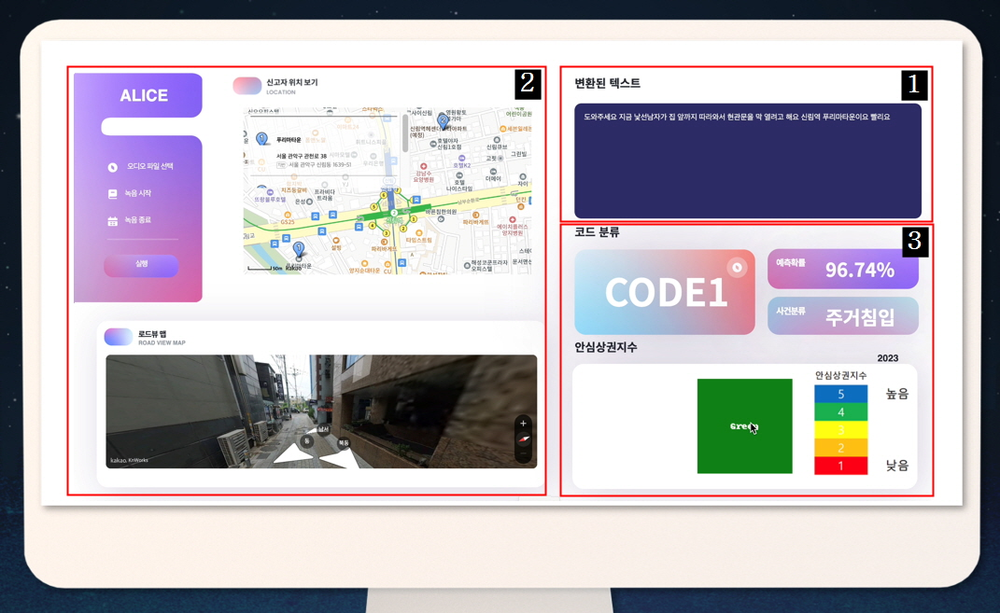
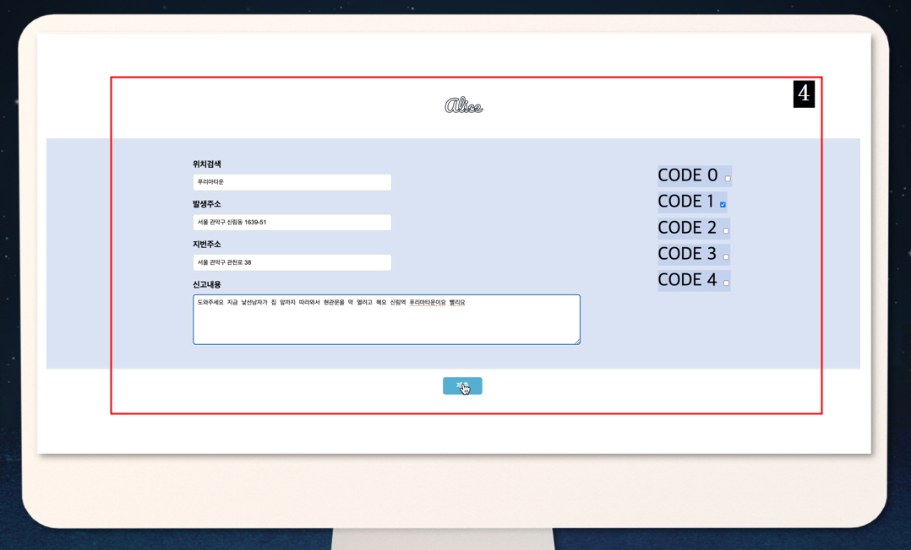

# **Alice: 112신고 음성기반 주소완성 및 코드 분류 서비스**
## 서비스 소개 
 <2023 데이터 청년 캠퍼스 한국외국어대학교 출품작>
 딥러닝 개체명 인식 기술을 활용한 112 신고 음성기반 주소완성 및 코드 분류 서비스로, 
신고자의 음성에서 사건 발생 장소를 특정하고, 긴급성 코드를 분류하여 출동시간을
확정합니다.

Alice 는 현 112 경찰 시스템의 1. 신고자의 정확한 주소를 일일이 검색 시스템에 입력
해야하며 2. 경찰관마다 같은 사건에 대해 다른 코드를 부여한다는 일관성의 문제를
인식하는 데에서 출발했습니다. 완성된 Alice 는 실제 경찰관님과 일반 시민대상 설문을
통해 해당 서비스의 타당성, 실효성에 대한 검증을 마쳤습니다.

## 데이터 모델 소개

Whisper: 신고자의 음성을 텍스트로 변환하기 위해 openai 에서 공개한 STT 모델인
Whisper API 를 사용합니다. Alice 의 경우 신고자의 음성에서 '주소'를 오차없이 받아적는
것이 중요하여 Aihub 의 주소발화 데이터로 fine tuning 하였습니다.
KLUE-BERT: 신고내용에서 주소를 자동으로 추출하여 특정해주는 작업을 위한 모델로
사용합니다. KLUE 데이터와 Naver NLP 챌린지 데이터, 자체 구축 데이터 등 총 14 만개
이상의 훈련 데이터로 학습되었습니다. 학습 데이터에 없는 고유한 거리, 가게이름까지
위치로 추출해 줍니다. 
TFBertForSequenceClassification: 신고내용에서 긴급성에 따라 사건의 코드를 자동으로
분류하기 위한 모델입니다. 현 경찰 시스템에서 사용하고 있는 '현행 매뉴얼 및 국민
코드로 재구성한 코드 체계', '112 신고 사건 유형 분류'를 기준으로 데이터를 자체
구축한 후 fine tuning 을 진행했습니다. 분류된 긴급성 코드와 사건 유형을 바탕으로
경찰은 출동시간을 확정하고 필요한 인력을 배치할 수 있습니다.

## **주요 파일 설명**
+ **"service/views.py"**
  + main code가 작성된 파일입니다.
  + 이 코드는 사용자로부터 오디오 파일을 받아, 그 내용을 분석하고 분류하여 특정 작업을 수행한 후 결과를 반환합니다.(실제 녹음할 경우 사용되는 부분입니다.)
+ **"stt.py"**
  + 이 코드는 Hugging Face의 Model Hub에 있는 모델에 WAV 파일을 전송하여 결과를 받아오는 코드입니다. (음성파일로 전달할 때 사용되는 파일입니다.)
  + WAV 파일을 읽어 API에 POST 요청을 보내고, 그 응답을 반환합니다.
+ **"ner.py"**
  + Hugging Face의 transformers를 이용해 학습시킨 NER 모델을 로드하고, 사용자의 문장 입력에 따라 개체명을 인식하여 결과를 출력하는 코드입니다.
  + 데이터같은 경우 ① KLUE-BERT 데이터 ② 2018 네이버 NLP 챌린지 데이터 ③ 자체구축 데이터로 이루어져 있습니다.
  + 자체구축 데이터의 경우에는 깃허브 내 madedata.txt파일로 존재합니다.

## **개발 환경**
+ **" 공용 컨테이너 환경인 goorm ide에서 개발을 진행하였습니다."** 
  
## **실행 방법**
+ python은 3.11version 사용하였습니다. 터미널에 들어가셔서 아래와 같은 절차를 따라주시면 됩니다**
  + git clone https://github.com/201803854/Alice
  + cd Alice
  + pip install -r requirements.txt
  + python manage.py runserver localhost:8000
  + localhost:8000/service/mymap  페이지에 들어가셔서 사용하시면 됩니다
  
### **실행 도중 주의사항**
 + 오디오 파일은 .wav만 가능합니다
 + 인공지능 모델 로딩되는 순서는 STT -> KLUE-BERT -> TFBertForSequenceClassification 순서입니다.
 + 모델이 순차적으로 로드되므로 처음 3회정도는 에러가 발생할 수 있습니다
  
### **requirements를 설치하는 도중 발생하는 에러모음**
+ Window 환경에서 발생한 에러 모음들입니다.
  + ① ERROR: Could not install packages due to an OSError: [Errno 2] No such file or directory:  
  + http://ngmsoftware.com/bbs/board.php?bo_table=study&wr_id=428&sfl=mb_id%2C1&stx=admin&sst=wr_nogood&sod=desc&sop=and&page=4
  
  + ② AttributeError: tuype object 'ImageDraw' has no attribute 'textsize
  + python3 -m pip list -v
  + python3 -c "import PIL;print(PIL.__version__)"
  + 만약 버전이 10.0이라면, 다운그레이드 해주시면 됩니다
  + python3 -m pip install Pillow==9.5.0

  + ③ WARNING: The script huggingface-cli.exe is installed in 'C:\Users\이동현\' which is not on PATH. Consider adding this directory to PATH or, if you prefer to suppress this warning, use --no-warn-script-location.
  + 시작 버튼을 마우스 오른쪽 버튼으로 클릭하고 '시스템'을 선택합니다.
  + 오른쪽에 있는 '고급 시스템 설정'을 클릭합니다.
  + '시스템 속성' 창 하단의 '환경 변수'를 클릭합니다.
  + '사용자 변수' 아래에서 PATH 변수를 찾아 '편집'을 클릭합니다.
  + 새로 만들기'를 클릭한 다음 디렉토리 경로를 붙여 넣습니다.
  + 확인을 눌러 변경 사항을 저장합니다.
  
## **시스템 구성도 및 웹 구현 화면**

Whisper를 통해 신고자의 음성을 텍스트로 변환하고, 변환된 텍스트로 부터 위치 개체명 추출 및 검색한 후 지도에 맵핑시켜 줍니다. 또한 신고자의 발화 내용으로 부터 얻을 수 있는 정보를 활용하여 사건의 긴급성 코드를 0번부터 4번까지 분류해준 후 사건의 유형 및 신고자의 위치에 해당하는 안심상권지수를 보여줍니다. 추가적으로 조서 작성 페이지를 클릭하면 사건이 일어난 위치, 도로명 및 지번 주소, 신고 내용이 자동으로 작성되어 있으며 수정 및 제출이 가능하게 됩니다. 

1. Whisper 를 통해 신고자의 음성을 텍스트로 변환합니다.
2. 개체명 인식으로 주소를 자동특정하여 지도, 로드뷰 형태로 띄워줍니다.
3. 사건의 긴급성 코드를 0 번부터 4 번까지 분류하고, 사건의 유형 및 신고자의 위치에 해당하는 안심상권지수를 보여줍니다.

4. 추가적으로 조서 작성 페이지를 클릭하면 사건이 일어난 위치, 도로명 및 지번 주소, 신고 내용이 자동으로 작성되어 있으며 수정 및 제출이 가능하게 됩니다. 

## **deep_learning_data**
 + madedata.txt
   NER(개체명 인식)에서 성능을 높이기 위해 사용한 직접 만든 데이터입니다.
 + code_alice.csv 
   코드 분류를 하기 위한 데이터입니다. (깨짐 현상이 있다면 Excel을 통해 열어주세요!)
## **deep_learning_model**
 + KLUE_BERT_Final_ver.ipynb
   NER(개체명 인식)을 하기 위한 모델입니다. google colab환경에서 바로 실행 가능합니다.
   
   

   
   
   
   